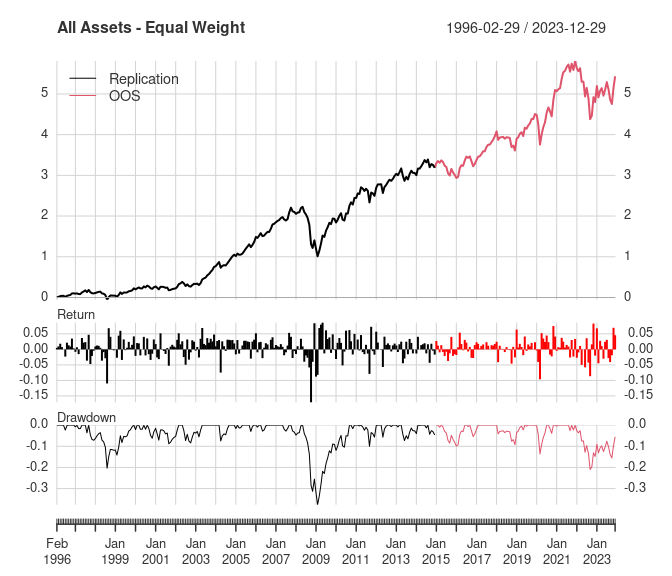
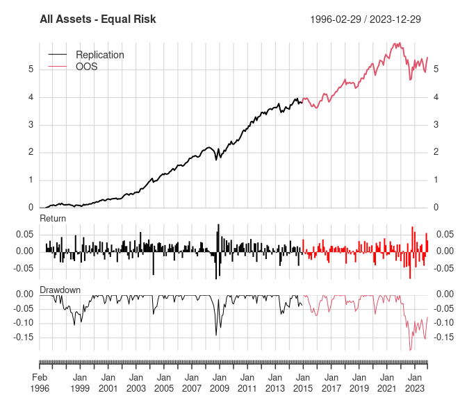
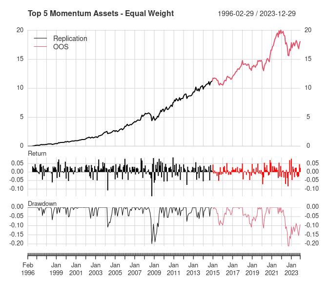
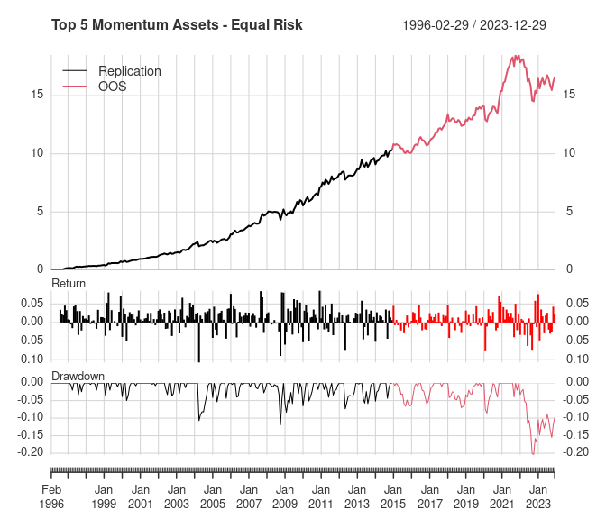
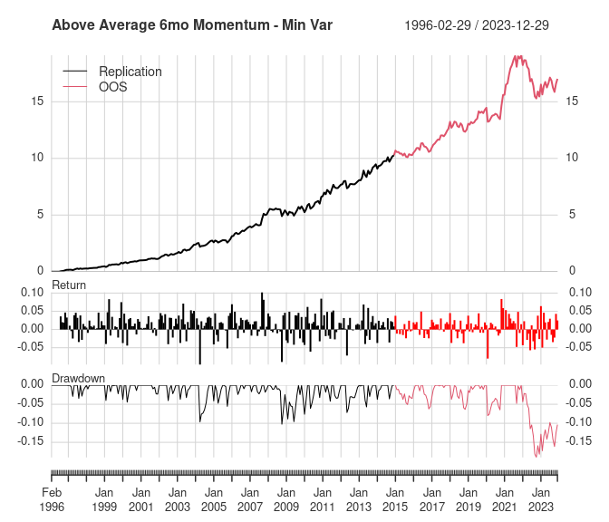

This post extends the replication in the previous post, {}, by running the
analysis on OOS (out-of-sample) data from 2015 through 2023. Thanks to
[Dale Rosenthal](https://www.q36llc.com/) for helpful comments.

<!--more-->

The paper uses the 5 portfolios below. Each section of this post will
give a short description of the portfolio construction and then focus on
comparing the OOS results with the replicated and original results. See
the other post for details on the data and portfolio construction
methodologies.

1.  Equal weight of all asset classes
2.  Equal risk contribution of all asset classes
3.  Equal weight of highest momentum asset classes
4.  Equal risk contribution of highest momentum asset classes
5.  Minimum variance of highest momentum asset classes

The table below summarizes the date ranges for each sample period in
this post.

| Period      | Date Range          |
|:------------|:--------------------|
| Replication | Feb 1996 - Dec 2014 |
| OOS         | Jan 2015 - Dec 2023 |
| 2015-2021   | Jan 2015 - Dec 2021 |
| Full        | Feb 1996 - Dec 2023 |

### 1. Equal weight portfolio of all asset classes

This portfolio assumes no knowledge of expected relative asset class
performance, risk, or correlation. It holds each asset class in equal
weight and is rebalanced monthly.  
<!-- new line for spacing -->

``` r
rr_equal_weight <- as.xts(apply(returns["/2014"], 1, mean))
ro_equal_weight <- as.xts(apply(returns["2015/"], 1, mean))
rf_equal_weight <- as.xts(apply(returns, 1, mean))

monthly_returns <-
  merge(Replication = to_monthly_returns(rr_equal_weight),
        OOS = to_monthly_returns(ro_equal_weight),
        "2015-2021" = to_monthly_returns(ro_equal_weight["2015/2021"]),
        Full = to_monthly_returns(rf_equal_weight),
        check.names = FALSE)

stats <- strat_summary(monthly_returns)
chart_performance(monthly_returns, "All Assets - Equal Weight")
```



|                           |  Replication|     OOS|  2015-2021|    Full|
|:--------------------------|------------:|-------:|----------:|-------:|
| Annualized Return         |        0.079|   0.049|      0.072|   0.069|
| Annualized Std Dev        |        0.115|   0.107|      0.091|   0.112|
| Annualized Sharpe (Rf=0%) |        0.684|   0.456|      0.794|   0.614|
| Worst Drawdown            |       -0.377|  -0.210|     -0.136|  -0.377|

The OOS annualized return is significantly less than the prior results.
This is largely due to the -21.0% drawdown that started in 2022 and is
still ongoing. Note that the full-period results are very similar to the
replication results, though the 2022 drawdown did decrease the
annualized return by \~1%.

Note that this portfolio's results from 2015-2021 are very similar to
the replication results through the end of 2014. That suggests the 2022
bear market is the main cause for the lower return in the OOS results.

### 2. Equal risk contribution using all asset classes

The next portfolio assumes the investor has some knowledge of each
asset's risk, but still no knowledge of relative performance or
correlations. So each asset in this portfolio is given a weight
proportional to its historical relative risk, with the hope that each
asset will contribute the same amount of risk to the overall portfolio
in the future.  
<!-- new line for spacing -->

``` r
rr_equal_risk <- portf_equal_risk(r_rep, 120, 60)
ro_equal_risk <- portf_equal_risk(r_oos, 120, 60)
rf_equal_risk <- portf_equal_risk(r_full, 120, 60)

monthly_returns <-
  merge(Replication = to_monthly_returns(rr_equal_risk),
        OOS = to_monthly_returns(ro_equal_risk["2015/"]),
        "2015-2021" = to_monthly_returns(ro_equal_risk["2015/2021"]),
        Full = to_monthly_returns(rf_equal_risk),
        check.names = FALSE)

stats <- strat_summary(monthly_returns)
chart_performance(monthly_returns, "All Assets - Equal Risk")
```



|                           |  Replication|     OOS|  2015-2021|    Full|
|:--------------------------|------------:|-------:|----------:|-------:|
| Annualized Return         |        0.086|   0.034|      0.056|   0.069|
| Annualized Std Dev        |        0.073|   0.082|      0.061|   0.076|
| Annualized Sharpe (Rf=0%) |        1.177|   0.411|      0.908|   0.903|
| Worst Drawdown            |       -0.142|  -0.194|     -0.071|  -0.194|

Like the equal weight portfolio, this portfolio's OOS annualized return
is significantly lower than the replication results. This methodology
only slightly reduced the 2022 drawdown to -19.4% from -21.0%. The
maximum drawdown is now in 2022 instead of during the 2008 financial
crisis.

In the replication, the equal risk contribution portfolio results are
better than the equal weight portfolio, but the OOS equal risk portfolio
did not show similar improvement. Even when 2022 is excluded, the OOS
equal risk portfolio didn't show improvement over the equal weight
portfolio.

### 3. Equal weight portfolio of highest momentum asset classes

The next portfolio assumes the investor has some knowledge of each
asset's returns, but still no knowledge of risk or correlations. Asset
returns are based on 6-month momentum (approximately 120 days). Momentum
is re-estimated every month and only the top 5 assets are included in
the portfolio.  
<!-- new line for spacing -->

``` r
rr_momo_eq_wt <- portf_top_momentum(r_rep, 5, 120)
ro_momo_eq_wt <- portf_top_momentum(r_oos, 5, 120)
rf_momo_eq_wt <- portf_top_momentum(r_full, 5, 120)

monthly_returns <-
  merge(Replication = to_monthly_returns(rr_momo_eq_wt),
        OOS = to_monthly_returns(ro_momo_eq_wt["2015/"]),
        "2015-2021" = to_monthly_returns(ro_momo_eq_wt["2015/2021"]),
        Full = to_monthly_returns(rf_momo_eq_wt),
        check.names = FALSE)

stats <- strat_summary(monthly_returns)
chart_performance(monthly_returns, "Top 5 Momentum Assets - Equal Weight")
```



|                           |  Replication|     OOS|  2015-2021|    Full|
|:--------------------------|------------:|-------:|----------:|-------:|
| Annualized Return         |        0.142|   0.051|      0.081|   0.112|
| Annualized Std Dev        |        0.114|   0.104|      0.092|   0.111|
| Annualized Sharpe (Rf=0%) |        1.243|   0.488|      0.884|   1.001|
| Worst Drawdown            |       -0.199|  -0.213|     -0.114|  -0.213|

Again, the OOS annualized return is significantly worse than the
replicated results. The OOS results for this portfolio show improvement
in the Sharpe Ratio versus the equal risk contribution portfolio (2).
The replicated results for this portfolio showed similar improvements
versus portfolio (2).

In the replication, equal weight momentum results are better than the
equal risk portfolio. But the OOS equal weight momentum portfolio did
not show significant improvement versus the equal risk portfolio (2),
and is roughly the same as the equal weight portfolio (1).

### 4. Equal risk contribution portfolio of highest momentum asset classes

The previous two portfolios estimated asset weights using either
risk-based or momentum-based weights. This next portfolio combines
estimates of momentum-based performance and accounts for asset class
risk differences. It includes the top 5 asset classes based on 6-month
returns and weights them using the same equal risk contribution method
as portfolio (2).  
<!-- new line for spacing -->

``` r
rr_momo_eq_risk <- portf_top_momentum_equal_risk(r_rep, 5, 120, 60)
ro_momo_eq_risk <- portf_top_momentum_equal_risk(r_oos, 5, 120, 60)
rf_momo_eq_risk <- portf_top_momentum_equal_risk(r_full, 5, 120, 60)

monthly_returns <-
  merge(Replication = to_monthly_returns(rr_momo_eq_risk),
        OOS = to_monthly_returns(ro_momo_eq_risk["2015/"]),
        "2015-2021" = to_monthly_returns(ro_momo_eq_risk["2015/2021"]),
        Full = to_monthly_returns(rf_momo_eq_risk),
        check.names = FALSE)


stats <- strat_summary(monthly_returns)
chart_performance(monthly_returns, "Top 5 Momentum Assets - Equal Risk")
```



|                           |  Replication|     OOS|  2015-2021|    Full|
|:--------------------------|------------:|-------:|----------:|-------:|
| Annualized Return         |        0.137|   0.050|      0.081|   0.108|
| Annualized Std Dev        |        0.102|   0.095|      0.081|   0.100|
| Annualized Sharpe (Rf=0%) |        1.335|   0.528|      0.991|   1.076|
| Worst Drawdown            |       -0.119|  -0.204|     -0.086|  -0.204|

It's clear that the major cause of the poorer OOS performance of this
portfolio is due to how it handled the 2022 bear market. This portfolio
handled the 2008 financial crisis very well, but it offered almost no
protection in 2022. This indicates there was a fundamental difference in
2008 versus 2022 in the asset classes held by this portfolio.

Similar to the replicated results, the reduction in risk is the main
benefit of this portfolio versus the equal weight momentum portfolio
(3). That said, the OOS performance of this portfolio only showed
marginal improvement versus portfolio (3). Even more notable, this
portfolio didn't improve returns versus the simple equal weight
portfolio (1) during the OOS period like it did for the replication
period.

### 5. Minimum variance portfolio of highest momentum asset classes

The final portfolio takes the above concepts and adds correlation
estimates to the portfolio optimization. The previous portfolios only
accounted for the relative risk between the asset classes, but not the
correlation between the assets' returns. This portfolio accounts for the
correlations between asset classes by finding the minimum variance
portfolio.  
<!-- new line for spacing -->

``` r
rr_momo_min_var <- portf_top_momentum_min_var(r_rep, 5, 120, 60)
ro_momo_min_var <- portf_top_momentum_min_var(r_oos, 5, 120, 60)
rf_momo_min_var <- portf_top_momentum_min_var(r_full, 5, 120, 60)

monthly_returns <-
  merge(Replication = to_monthly_returns(rr_momo_min_var),
        OOS = to_monthly_returns(ro_momo_min_var["2015/"]),
        "2015-2021" = to_monthly_returns(ro_momo_min_var["2015/2021"]),
        Full = to_monthly_returns(rf_momo_min_var),
        check.names = FALSE)

stats <- strat_summary(monthly_returns)
chart_performance(monthly_returns, "Above Average 6mo Momentum - Min Var")
```



|                           |  Replication|     OOS|  2015-2021|    Full|
|:--------------------------|------------:|-------:|----------:|-------:|
| Annualized Return         |        0.137|   0.054|      0.086|   0.109|
| Annualized Std Dev        |        0.103|   0.094|      0.084|   0.100|
| Annualized Sharpe (Rf=0%) |        1.330|   0.568|      1.025|   1.086|
| Worst Drawdown            |       -0.102|  -0.190|     -0.080|  -0.190|

Recall that the original results for portfolio (5) showed improved
return and lower maximum drawdown versus portfolio (4), while the
replicated results were almost the same for both portfolios. The OOS
results for these two portfolios are also very similar. In the 2015-2021
period, portfolio (5) has a slightly higher return and Sharpe ratio and
lower max drawdown than portfolio (4).

Conclusion
----------

For all 5 portfolios, the OOS results are not as good as the replicated
results. This is largely due to the 2022 bear market, but the 2015-2021
results still aren't as good as the replicated results.

[Allocate
Smartly](https://allocatesmartly.com/tactical-asset-allocation-performance-during-the-2022-bear-market/)
has a great post about 2022 bear market performance of tactical asset
allocation (TAA) strategies like this one. They find that TAA strategies
did poorly in the 2022 bear market if they assumed intermediate and
long-term bonds provide diversification from risky assets. Both risk
assets and longer duration bonds performed poorly in 2022, and the
correlation between bonds and equities was positive instead of negative
like they have been historically.

In a future post, I may investigate how these portfolios would have
performed if they were allowed to allocate to short-term Treasuries.

### Portfolio Results by Sample Period

This section contains tables with results for all portfolios in a
particular sample period.

##### Replication Period

|              |  Equal Weight|  Equal Risk|  Momo Eq Weight|  Momo Eq Risk|  Momo Min Var|
|:-------------|-------------:|-----------:|---------------:|-------------:|-------------:|
| Ann. Return  |         0.079|       0.086|           0.142|         0.137|         0.137|
| Ann. Std Dev |         0.115|       0.073|           0.114|         0.102|         0.103|
| Ann. Sharpe  |         0.684|       1.177|           1.243|         1.335|         1.330|
| Max Drawdown |        -0.377|      -0.142|          -0.199|        -0.119|        -0.102|

##### Out-of-Sample: 2015-2023

|              |  Equal Weight|  Equal Risk|  Momo Eq Weight|  Momo Eq Risk|  Momo Min Var|
|:-------------|-------------:|-----------:|---------------:|-------------:|-------------:|
| Ann. Return  |         0.049|       0.034|           0.051|         0.050|         0.054|
| Ann. Std Dev |         0.107|       0.082|           0.104|         0.095|         0.094|
| Ann. Sharpe  |         0.456|       0.411|           0.488|         0.528|         0.568|
| Max Drawdown |        -0.210|      -0.194|          -0.213|        -0.204|        -0.190|

##### Out-of-Sample: 2015-2021

|              |  Equal Weight|  Equal Risk|  Momo Eq Weight|  Momo Eq Risk|  Momo Min Var|
|:-------------|-------------:|-----------:|---------------:|-------------:|-------------:|
| Ann. Return  |         0.072|       0.056|           0.081|         0.081|         0.086|
| Ann. Std Dev |         0.091|       0.061|           0.092|         0.081|         0.084|
| Ann. Sharpe  |         0.794|       0.908|           0.884|         0.991|         1.025|
| Max Drawdown |        -0.136|      -0.071|          -0.114|        -0.086|        -0.080|
