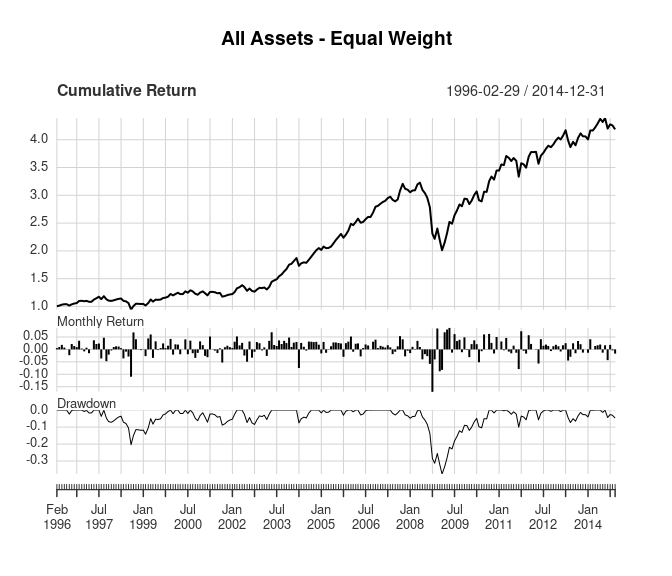
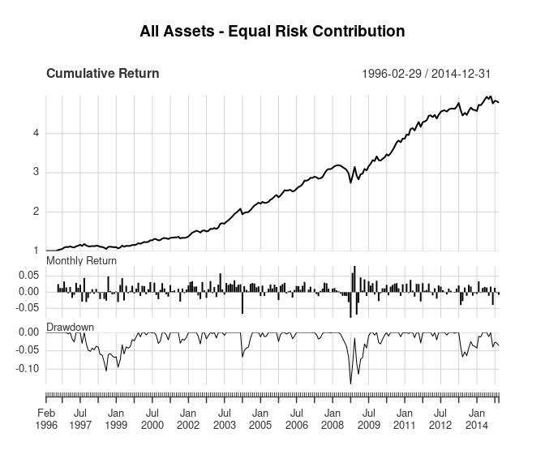

<!--
# render for blog:
Rscript -e 'rmarkdown::render("adaptive-asset-allocation-replication.Rmd", rmarkdown::md_document(preserve_yaml = TRUE, pandoc_args = "--to=markdown_strict+all_symbols_escapable+backtick_code_blocks+fenced_code_blocks+space_in_atx_header+intraword_underscores+lists_without_preceding_blankline+shortcut_reference_links+pipe_tables+strikeout+autolink_bare_uris+task_lists+definition_lists+footnotes+smart+tex_math_dollars"), "index.md")'

# create R code for blog
Rscript -e 'knitr::purl("index.Rmd")'
-->

The paper, ["Adaptive Asset Allocation: A Primer"](https://papers.ssrn.com/sol3/papers.cfm?abstract_id=2328254) by Adam Butler, Mike Philbrick, Rodrigo Gordillo, and David Varadi addresses flaws in the traditional application of Modern Portfolio Theory related to Strategic Asset Allocation. It shows that estimating return and (co)variance parameters over shorter time horizons are superior to estimates over long-term horizons because parameter estimates vary substantially over time. Longer-term estimates do not account for this variability in the short-term. They propose an Adaptive Asset Allocation portfolio construction methodology that uses the new parameter estimates to substantially improve performance relative to Strategic Asset Allocation.

<!--more-->

Data
====

The original paper creates portfolios from 10 major global asset classes using data between 1995 and 2014. It uses ETFs when possible, and uses passive no-load mutual funds, underlying indexes, and no-load active mutual funds as proxies for asset class returns prior to ETF inception. The paper doesn't list the actual instruments used at each point in time, so this post attempts to replicate their described methodology using publicly available data.

The table below shows the asset class, instruments, and time horizons used for each asset class in this replication. The data start in late 1997 instead of 1995 as in the original paper. Returns in this analysis are adjusted for splits and dividends.

|                            | ETF | ETF Start | Fund  | Fund Start |
|:---------------------------|:----|:----------|:------|:-----------|
| US Equity                  | VTI | 2001-05   | VTSMX | 1992-04    |
| European Equity            | VGK | 2005-03   | VEURX | 1990-06    |
| Japanese Equity            | EWJ | 1996-03   | FJPNX | 1992-12    |
| Emerging Market Equity     | EEM | 2003-04   | VEIEX | 1994-12    |
| US Real Estate             | ICF | 2001-02   | VGSIX | 1996-05    |
| International Real Estate  | RWX | 2006-12   | XRFIX | 1997-09    |
| Intermediate Term Treasury | IEF | 2002-07   | VFITX | 1991-12    |
| Long Term Treasury         | TLT | 2002-07   | VUSTX | 1986-12    |
| Commodities                | DBC | 2006-02   | QRACX | 1997-03    |
| Gold                       | GLD | 2004-11   | SGGDX | 1993-08    |

This post uses the [ftblog](https://github.com/joshuaulrich/ftblog) package. You can install it using the `remotes::install_github()` function in the code block below. First we need to setup our environment with the necessary packages, data, and functions.

``` r
# remotes::install_github("joshuaulrich/ftblog")
suppressPackageStartupMessages({
    library(ftblog)
    library(PerformanceAnalytics)
})

data(aaa_returns, package = "ftblog")
# Only use data through the end of 2014, and no cash
returns <- aaa_returns["/2014", -1]

# calculate strategy statistics
strat_summary <-
function(returns,
         original_results = NULL)
{
    stats <- table.AnnualizedReturns(returns)
    stats <- rbind(stats,
                   "Worst Drawdown" = -maxDrawdown(returns))
    colnames(stats) <- "Replication"

    if (!is.null(original_results)) {
        stats <- cbind(stats, original_results)
        colnames(stats)[2] <- "Original"
    }

    stats <- round(stats, 3)

    return(stats)
}
```

Replication
===========

This analysis attempts to replicate all 5 portfolios in the original paper.

1.  Equal weight of all asset classes
2.  Equal risk contribution of all asset classes
3.  Equal weight of highest momentum asset classes
4.  Equal risk contribution of highest momentum asset classes
5.  Minimum variance of highest momentum asset classes

The original paper showed results as a monthly series. The `to_monthly_returns()` function converts the strategy returns from daily to monthly. The `strat_summary()` function uses the [PerformanceAnalytics](https://cran.r-project.org/package=PerformanceAnalytics) package to calculate summary statistics to compare with the original paper. The file [adaptive-asset-allocation-replication.R](adaptive-asset-allocation-replication.R) contains all the code used in this analysis, and the [returns.rds](returns.rds) function contains the data.

### 1. Equal weight portfolio of all asset classes

The baseline example assumes no knowledge of expected relative asset class performance, risk, or correlation. The results below are based on a portfolio that holds each asset class in equal weight and is rebalanced monthly. The table compares the results of this replication with the original results. Some of the difference in results are due to the different instruments and time frames used for the analysis. Despite the differences in the data between the two approaches, the results are very similar.

The `returns_equal_weight` object contains the portfolio returns for each day. Then we convert those returns to monthly and evaluate the portfolio results.

  
<!-- new line for spacing -->

``` r
returns_equal_weight <-
    as.xts(apply(returns, 1, mean)) |>
    to_monthly_returns()

title <- "All Assets - Equal Weight"
stats <- strat_summary(returns_equal_weight,
                       original_results = c(0.081, 0.112, 0.72, -0.392))
charts.PerformanceSummary(returns_equal_weight, main = title, wealth.index = TRUE)
```



|                           |  Replication|  Original|
|:--------------------------|------------:|---------:|
| Annualized Return         |        0.079|     0.081|
| Annualized Std Dev        |        0.115|     0.112|
| Annualized Sharpe (Rf=0%) |        0.684|     0.720|
| Worst Drawdown            |       -0.377|    -0.392|

### 2. Equal risk contribution using all asset classes

The next portfolio assumes the investor has some knowledge of each asset's risk, but still no knowledge of relative performance or correlations. So each asset in this portfolio is given a weight proportional to its relative risk, and each asset contributes the same amount of risk to the overall portfolio. That way no asset's risk will dominate the risk of the overall portfolio.

The `portf_return_equal_risk()` estimates the equal risk contribution portfolio using the `PERC()` function from the [FRAPO](https://cran.r-project.org/package=FRAPO) package. It calculates the portfolio weights at the end of month using estimated portfolio risk from the returns over the last 60 days. Then those weights are used to calculate the portfolio returns for the following month.  
<!-- new line for spacing -->

``` r
returns_equal_risk <-
    portf_return_equal_risk(returns, 120, 60) |>
    to_monthly_returns()

title <- "All Assets - Equal Risk Contribution"
stats <- strat_summary(returns_equal_risk,
                       original_results = c(0.085, 0.086, 0.99, -0.242))
charts.PerformanceSummary(returns_equal_risk, main = title, wealth.index = TRUE)
```



|                           |  Replication|  Original|
|:--------------------------|------------:|---------:|
| Annualized Return         |        0.086|     0.085|
| Annualized Std Dev        |        0.073|     0.086|
| Annualized Sharpe (Rf=0%) |        1.177|     0.990|
| Worst Drawdown            |       -0.142|    -0.242|

In this case, the replicated results are better than the original results. The data differences and the method used to estimate the equal risk contribution portfolio weights are the most likely explanation for the differences in the replicated results.

### 3. Equal weight portfolio of highest momentum asset classes

The next portfolio assumes the investor has some knowledge of each asset's returns, but still no knowledge of risk or correlations. The original paper uses momentum to estimate each asset's returns because momentum (also known as long-term memory) is a well-known property of financial market returns. Assets that have increased (decreased) in price are likely to continue increasing (decreasing) in price in the next period. Academic research shows that instruments with higher (lower) momentum over the past 1-12 months exhibits better (worse) performance over short-term future periods. See the original paper for a description of some reasons why momentum exists in financial markets.

The estimates of each asset's returns are based on 6-month momentum (approximately 120 days). Momentum is re-estimated every month and only the top 5 assets are included in the portfolio, rather than including every asset in the portfolio. Note that this doesn't mean every asset included in the portfolio has a positive return over the 6-month period. All of them could have negative returns over the period, in which case the 5 assets with the smallest losses would be included in the portfolio. Each of the top 5 assets included in the portfolio are held with equal weight.  
<!-- new line for spacing -->

``` r
returns_momo_equal_weight <-
    portf_return_momo(returns, 5, 120) |>
    to_monthly_returns()

title <- "Top 5 Assets by 6-month Momentum - Equal Weight"
stats <- strat_summary(returns_momo_equal_weight,
                       original_results = c(0.130, 0.110, 1.17, -0.217))
charts.PerformanceSummary(returns_momo_equal_weight, main = title, wealth.index = TRUE)
```


|                           |  Replication|  Original|
|:--------------------------|------------:|---------:|
| Annualized Return         |        0.142|     0.130|
| Annualized Std Dev        |        0.114|     0.110|
| Annualized Sharpe (Rf=0%) |        1.243|     1.170|
| Worst Drawdown            |       -0.199|    -0.217|

The replicated results have slightly better returns and maximum drawdown, but similar standard deviation. That said, the results are similar enough to suggest this analysis replicates the approach accurately.

### 4. Equal risk contribution portfolio of highest momentum asset classes

The previous two portfolios estimated asset weights using either risk-based or momentum-based weights. This next portfolio combines estimates of momentum-based performance and accounts for asset class risk differences. It includes the top 5 asset classes based on 6-month returns and weights them using the `estimate_equal_risk_portf()` function defined earlier. Recall that the function weights each asset class so they each contribute the same amount of risk to the portfolio. Note that the asset volatilities are calculated on 60 days (approximately 3 months) of returns while the momentum is based on 120 days (approximately 6 months).

  
<!-- new line for spacing -->

``` r
returns_momo_equal_risk <-
    portf_return_momo_equal_risk(returns, 5, 120, 60) |>
    to_monthly_returns()

title <- "Top 5 Assets by 6-month Momentum - Equal Risk Contribution"
stats <- strat_summary(returns_momo_equal_risk,
                       original_results = c(0.140, 0.099, 1.41, -0.148))
charts.PerformanceSummary(returns_momo_equal_risk, main = title, wealth.index = TRUE)
```


|                           |  Replication|  Original|
|:--------------------------|------------:|---------:|
| Annualized Return         |        0.137|     0.140|
| Annualized Std Dev        |        0.102|     0.099|
| Annualized Sharpe (Rf=0%) |        1.335|     1.410|
| Worst Drawdown            |       -0.119|    -0.148|

The original and replicated results for this portfolio are very similar. Note that in the original paper this portfolio's overall return increased to 14.0% versus 13.0% for the momentum-based equal weight portfolio, but the replicated results were more similar (14.2% versus 13.7%). Again, the data differences and portfolio weight estimation differences likely cause differences in the results. Also, an un-scientific comparison of the two cumulative return graphs suggests some difference may be due to performance in 2012, when the replicated results have a significant drawdown while the original results showed positive performance.

### 5. Minimum variance portfolio of highest momentum asset classes

The final portfolio takes the above concepts and adds correlation estimates to the portfolio optimization. The previous portfolios only accounted for the relative risk between the asset classes, but not the correlation between the assets' returns. This portfolio accounts for the correlations between asset classes by finding the minimum variance portfolio using [modern portfolio theory](https://en.wikipedia.org/wiki/Modern_portfolio_theory). The asset selection for these portfolios in the original paper differ slightly from the previous portfolios. Instead of taking the top 5 assets with the highest momentum, the original paper selects "assets with above average 6-month momentum". So it's not clear how many assets are held in the portfolio each month.  
<!-- new line for spacing -->

``` r
returns_momo_min_var <-
    portf_return_momo_min_var(returns, 5, 120, 60, "above average") |>
    to_monthly_returns()

title <- "Assets With Above Average 6-month Momentum - Minimum Variance"
stats <- strat_summary(returns_momo_min_var,
                       original_results = c(0.150, 0.094, 1.60, -0.088))
charts.PerformanceSummary(returns_momo_min_var, main = title, wealth.index = TRUE)
```


|                           |  Replication|  Original|
|:--------------------------|------------:|---------:|
| Annualized Return         |        0.130|     0.150|
| Annualized Std Dev        |        0.099|     0.094|
| Annualized Sharpe (Rf=0%) |        1.315|     1.600|
| Worst Drawdown            |       -0.112|    -0.088|

The replicated results still show worse performance than the original results, which also seems to be related to performance during 2012. The replicated results also do not show significant improvement relative to the top 5 momentum equal risk portfolio like the original paper shows.

Conclusion
==========

Despite using returns from different instruments in the same asset classes, over a slightly different time period, this analysis closely replicates the results from [Adaptive Asset Allocation: A Primer](https://papers.ssrn.com/sol3/papers.cfm?abstract_id=2328254). The differences in the data sets seem to create a significant difference in performance during 2012, but otherwise produce similar results on monthly data.

See {} for an analysis of the out-of-sample performance of these portfolios. Thanks for reading!
