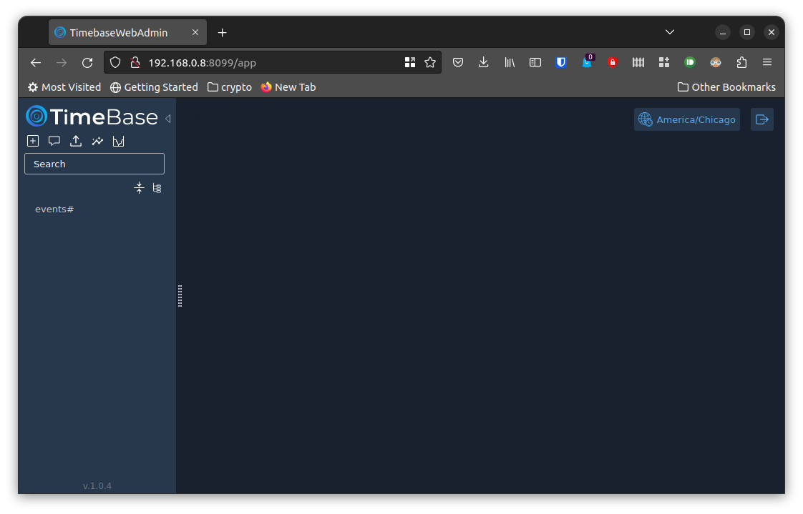
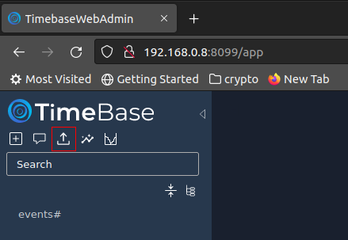
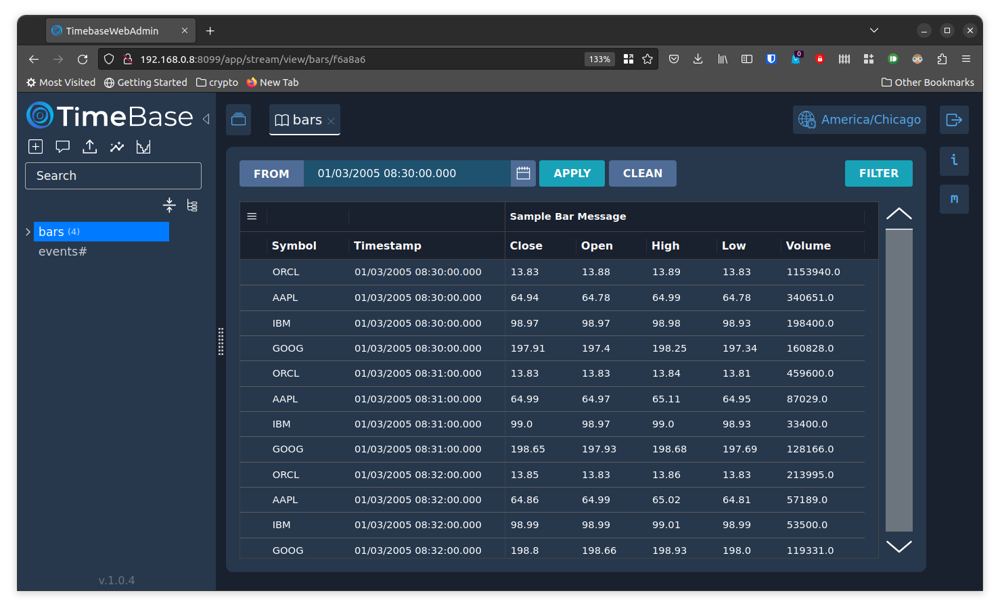

This is the second post in the series on using [TimeBase](https://timebase.info/) to stream real-time market data. This post covers using [Docker](https://www.docker.com/) to run TimeBase and the [TimeBase Web Administrator](https://kb.timebase.info/docs/development/tools/Web%20Admin/admin_about).

<!--more-->

### Getting Started

Docker installation and configuration is outside the scope of this post. Docker has a [Get Started](https://www.docker.com/get-started/) page to help you get set up.

I'll be using Docker via Ubuntu and the command line interface. I know this approach is probably very advanced for most readers, but please bear with me. The concepts should be the same if you're using the [Docker Desktop](https://docs.docker.com/desktop/) GUI instead.

If you're not familiar with Docker, an "image" contains all the necessary information to run an instance of the application. A "container" is a running instance of an image.

### Running the Docker Containers

First we need to get the container images from [Docker Hub](https://hub.docker.com/). I will use the `docker pull` command.

```sh
# pull the TimeBase image
docker pull finos/timebase-ce-server:6.1.16

# pull the Web Admin image
docker pull epam/timebase-ws-server:1.0
```

The TimeBase documentation has a page on [deploying with Docker](https://kb.timebase.info/community/deployment/docker). This post closely follows those examples.

One major difference is that TimeBase documentation uses the `--link` option to allow the containers to talk to each other, but the Docker documentation says that is a legacy feature that may be removed. The currently preferred method is to create a user-defined network.

```sh
# create a user-defined network so the containers to see each other
docker network create --driver bridge timebase-net

# make sure the network was created
docker network ls
```

By default, the docker containers will write data to a disk that's only available to the container. You won't be able to access the data from your computer or if the container isn't running. There's a `--volume` option to specify a mapping between a directory in the container and a directory on your local machine. I'm not going to use that here because you have to run the container as root in order for it to write to your local file system.

```sh
docker run --rm --detach \
    --publish 8011:8011 \
    --name timebase-server \
    --user deltix:deltix \
    --ulimit=nofile=65536:65536 \
    --network timebase-net \
    finos/timebase-ce-server:6.1.16
```

Here are the descriptions of the options used:

* `--rm`: Automatically remove the container when it exits
* `--detach`: Run the container in the background
* `--publish`: Map the container's port 8011 to my computer's port 8011
* `--name`: Assign a name to the container
* `--user`: Run the container as the 'deltix' user instead of 'root'
* `--ulimit`: Set user process resource limits
* `--network`: Use the 'timebase-net' network

Now we can run the Web Admin container. Make sure to use the same network (`timebase-net`) and make sure the host name (`dxtick://timebase-server`) is the same as the name you used for the TimeBase container (i.e. 'timebase-server' in this case). The `--env` option allows us to set environment variables. These are used to control various [configuration options](https://kb.timebase.info/community/development/tools/Web%20Admin/admin_config#deployment) (note that these configuration options are for running a local instance, but they give you an idea of what you can change).

```sh
docker run --rm --detach \
    --publish 8099:8099 \
    --name timebase-admin \
    --env "JAVA_OPTS=-Dtimebase.url=dxtick://timebase-server:8011" \
    --network timebase-net \
    epam/timebase-ws-server:1.0
```

We can use the Web Admin's interface once it's running. Open a browser and enter localhost:8099 in the address bar. That should take you to the login page. The default username/password is `admin/admin`. After you log in you should see a page like the image below. The only stream in the database is `events#`.

[](web-admin-initial-contents.png)

Although this post is about *running* TimeBase and the Web Admin, I'm not going to end it without showing a little functionality.

### Import Data

Let's import some data and take a quick look. Download this [data file](running-timebase-in-docker-bars.qsmsg.gz). Then click the 'Import from QSMSG' button highlighted in red below.

[](web-admin-import-qsmsg-button.png)

Navigate to the file you just downloaded. Name the stream 'bars'. You can leave the Description and Symbols fields blank, and leave Periodicity set to irregular.

Now click the 'bars' stream in the navigation bar on the left. You should see the data you just imported. It looks like the image below.

[](web-admin-after-importing-bars.png)

Okay, that's all for now. In the next post, we'll set up a data connector and watch some data stream into the database!


